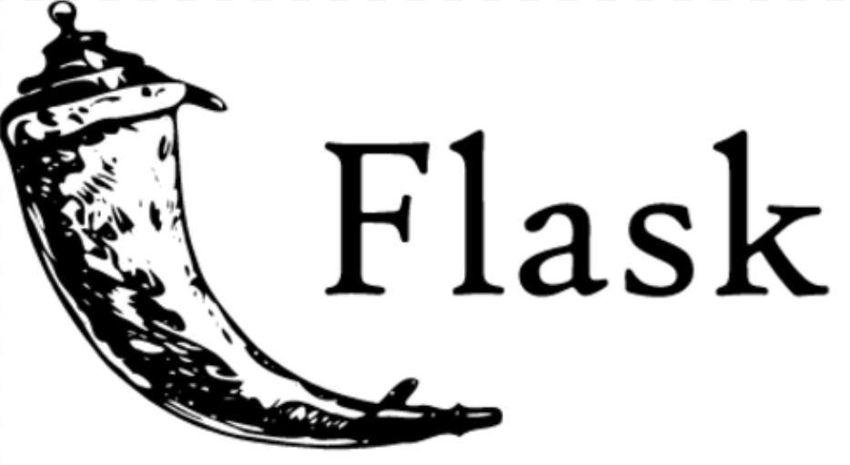
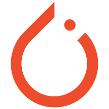
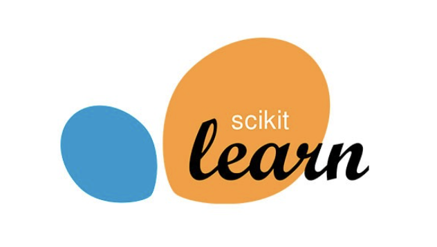
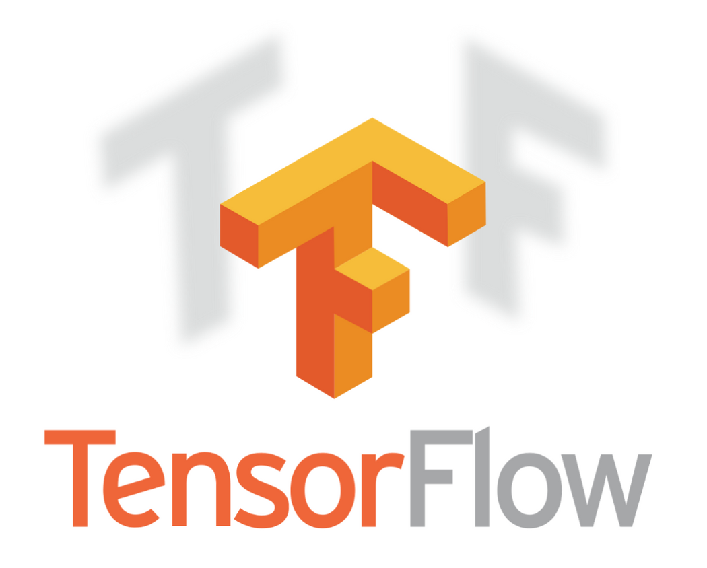
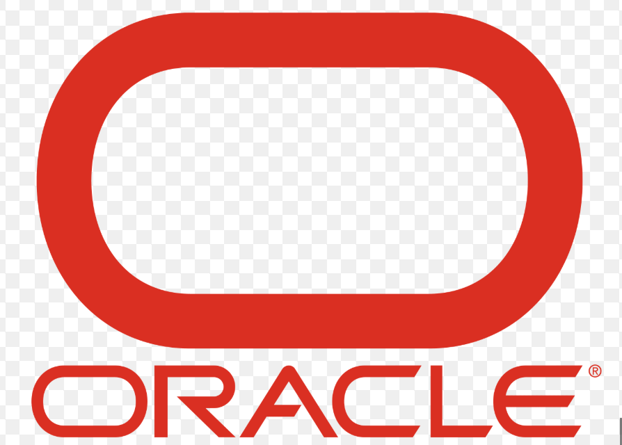
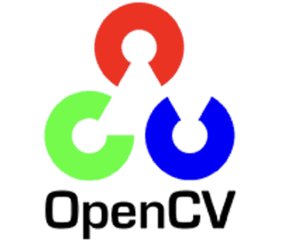
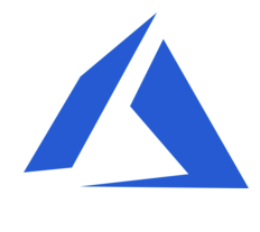

<h1 align="center"> Hi 👋, I'm Garv Agarwal </h1>
<h3 align="center">🚀Code. Create. Innovate.</h3>
<table>
  <tr>
    <td>
      <h3>🚀 Data Science | Data Analyst | AI & ML Enthusiast</h3>
      
I'm passionate about solving real-world problems using technology and building impactful products through Data Science and AI.

    </td>
    <td>
      
    </td>
  </tr>
</table>

  

<h3 align="left">Connect with me:</h3>

- 👯 I’m looking to collaborate on **Time Series Forecasting Projects, Assistive Technology Projects and Assistive Technology Projects**

- 💬 Ask me about **Data Science, Machine Learning, Time Series Forecasting and API Integration**

- 📫 [agarwalgarv494@gmail.com](mailto:agarwalgarv494@gmail.com)

- 📄 [Know about my experiences](https://drive.google.com/file/d/1XwreP2DryzItqQMsY3M7ivi6UHTTbcFg/view?usp=sharing)

- ⚡ Fun fact **Coffee is my second programming language.**

<h3 align="left">Languages and Tools:</h3>
 
<code></code>
<code></code>
<code></code>
<code></code>
<code></code>
<code></code>
<code></code>
<code></code>
<code></code>
<code></code>
<code></code>
<code></code>
<code></code>
<code></code>
<code></code>
<code></code>
<code></code>
<code></code>
<code></code>
<code></code>
<code></code>
<code></code>
<code></code>
<code></code>
 
 
 
<!--

     
</a>
                  

-->

<!--

-->

